<div align="center">

<!-- Animated Typing Header -->
<a href="https://github.com/helinertgrl">
  
</a>

<br/>

<picture>
  
</picture>

<!-- Badges -->
<p align="center">
  
  
  
  
  
</p>

<p align="center">
  
  
  
  
</p>

<br/>

> **A full-stack Android application built with modern best practices — featuring Firebase Authentication, a REST API via Ktor, local persistence with Room, and a reactive UI powered by Jetpack Compose.**

<br/>

</div>

---

## 📱 Screenshots

<div align="center">

| Login | Shop | Cart | Profile |
|:---:|:---:|:---:|:---:|
|  |  |  |  |
| Firebase Auth | Search & Filter | Room DB | User Profile |

</div>

---

## ✨ Features

<div align="center">

| 🔐 Authentication | 🛍️ Shopping | 🛒 Cart | 👤 Profile |
|---|---|---|---|
| Firebase Email/Password Login | Product listing from REST API | Add / Remove items | Display user info |
| Sign Up & Sign In flows | Search by name | Real-time total price | Logout functionality |
| Session persistence | Filter by price & premium | Persistent via Room DB | — |
| — | Sort by name or price | Checkout button | — |

</div>

---

## 🏗️ Architecture

This project follows **MVVM (Model-View-ViewModel)** architecture with a clean **layered package structure** for scalability and separation of concerns.

```mermaid
graph TD
    subgraph UI ["🖥️  UI LAYER — Jetpack Compose"]
        A["🛍️ ShopScreen"]
        B["🛒 CartScreen"]
        C["👤 ProfileScreen"]
    end

    subgraph VM ["⚙️  VIEWMODEL LAYER"]
        D["ShopViewModel\nState + Business Logic"]
        E["CartViewModel\nState + Business Logic"]
    end

    subgraph DATA ["💾  DATA LAYER"]
        F["ProductRepository\nSingle Source of Truth"]
        G["🗄️ Room Database\nLocal Persistence"]
        H["🌐 Ktor / MockAPI\nRemote Data Source"]
    end

    subgraph AUTH ["🔥  FIREBASE"]
        I["Firebase Auth\nLogin · Session"]
    end

    A -->|observes state| D
    B -->|observes state| E
    C -->|reads user| I
    D -->|reads & writes| F
    E -->|reads & writes| F
    F -->|cache| G
    F -->|fetch| H

    style UI fill:#1a2a4a,stroke:#4285F4,color:#fff
    style VM fill:#2a1a4a,stroke:#7F52FF,color:#fff
    style DATA fill:#1a3a2a,stroke:#0f9d58,color:#fff
    style AUTH fill:#2a2a1a,stroke:#FFCA28,color:#fff
```



<br/>

### 🔄 Data Flow

```mermaid
flowchart LR
    API["☁️ MockAPI\nREST Endpoint"]
    KTOR["⚡ Ktor Client\nHTTP Request"]
    REPO["📦 Repository\nSource of Truth"]
    VM["🧠 ViewModel\nStateFlow"]
    UI["📱 Compose UI\ncollectAsState()"]
    ROOM["🗄️ Room DB\nLocal Cache"]

    API -->|"GET /products"| KTOR
    KTOR -->|"parse JSON"| REPO
    REPO <-->|"read / write"| ROOM
    REPO -->|"emit Flow"| VM
    VM -->|"State → recompose"| UI

    style API fill:#0f9d58,stroke:#0f9d58,color:#fff
    style KTOR fill:#1c2128,stroke:#7F52FF,color:#fff
    style REPO fill:#1c2128,stroke:#4285F4,color:#fff
    style VM fill:#1c2128,stroke:#7F52FF,color:#fff
    style UI fill:#4285F4,stroke:#4285F4,color:#fff
    style ROOM fill:#1c2128,stroke:#0f9d58,color:#fff
```



---

## 🛠️ Tech Stack

| Layer | Technology | Purpose |
|---|---|---|
| **Language** | Kotlin 2.0.21 | Primary programming language |
| **UI** | Jetpack Compose + Material3 | Declarative modern UI |
| **Architecture** | MVVM | Separation of concerns |
| **Navigation** | Navigation Compose 2.9.6 | Screen routing |
| **Networking** | Ktor Client 3.2.1 | REST API calls |
| **Serialization** | Kotlinx Serialization | JSON parsing |
| **Local DB** | Room 2.6.1 | Cart persistence |
| **Image Loading** | Coil Compose 2.5.0 | Async image loading |
| **Authentication** | Firebase Auth (BOM 33.7.0) | Secure login/signup |
| **Build System** | Gradle KTS + Version Catalog | Dependency management |
| **CI/CD** | GitHub Actions | Automated build & test |
| **Min SDK** | API 24 (Android 7.0) | Wide device coverage |
| **Target SDK** | API 36 | Latest Android features |

---

## ⚙️ CI/CD Pipeline

This project uses **GitHub Actions** for continuous integration. Every push to `master` triggers an automated build pipeline.

```mermaid
flowchart LR
    PUSH["📤 Git Push\nto master"]
    TRIGGER["⚡ GitHub Actions\nWorkflow Triggered"]
    BUILD["🔨 Gradle Build\nassembleDebug · JDK 17"]
    TEST["🧪 Tests\nlint + unit tests"]
    SUCCESS["✅ PASSING\nCI/CD Test #3 · d19bc86"]

    PUSH --> TRIGGER --> BUILD --> TEST --> SUCCESS

    style PUSH fill:#1c2128,stroke:#6e7681,color:#fff
    style TRIGGER fill:#1c2128,stroke:#2088FF,color:#fff
    style BUILD fill:#1c2128,stroke:#7F52FF,color:#fff
    style TEST fill:#1c2128,stroke:#FFCA28,color:#fff
    style SUCCESS fill:#238636,stroke:#2ea043,color:#fff
```



> **Latest build:** `build: upgrade JDK to 17` — ✅ Android CI/CD Test #3 passed · commit `d19bc86`

---

## 🚀 Getting Started

### Prerequisites

- Android Studio **Hedgehog** or newer
- JDK **17**
- Android device or emulator (API 24+)
- A **Firebase project** (for Authentication)

### Installation

```bash
# 1. Clone the repository
git clone https://github.com/helinertgrl/MyDevelopmentApp.git

# 2. Open in Android Studio
# File → Open → Select the cloned folder

# 3. Add your google-services.json
# Place it in the /app directory from your Firebase Console

# 4. Build & Run
./gradlew assembleDebug
```

### Firebase Setup

1. Go to [Firebase Console](https://console.firebase.google.com/)
2. Create a new project
3. Enable **Email/Password** sign-in method
4. Download `google-services.json` and place it in `/app`

---

## 📦 Dependencies Overview

```toml
[versions]
kotlin              = "2.0.21"
agp                 = "8.12.3"
composeBom          = "2024.09.00"
room                = "2.6.1"
ktor                = "3.2.1"
coil                = "2.5.0"
navigationCompose   = "2.9.6"
firebaseBom         = "33.7.0"
```

---


<div align="center">

## 👩‍💻 Author

**helinertgrl**

*Android Developer in progress — learning, building, and growing every day.*

<br/>

[](https://www.linkedin.com/in/helin-ertu%C4%9Frul/)

<br/>

---

*Built with ☕ and lots of Kotlin*

<br/>
</div>
